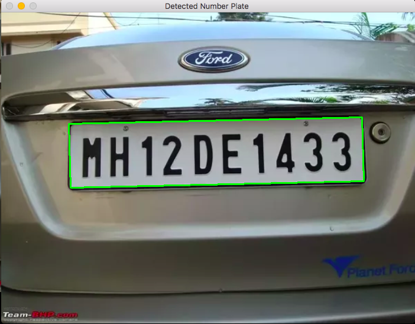
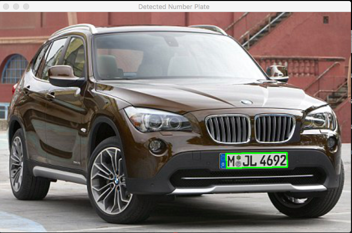
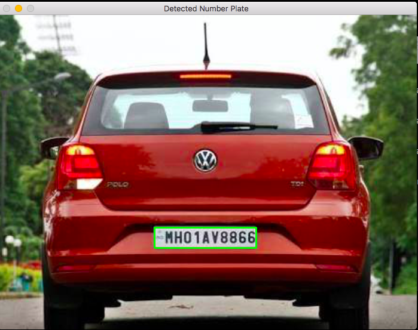

# Automated Licence Plate Recognition System
Automatically extract number plate from vehicle and recognise
the number plate using OCR (optical character recognition).

## Requirements
- Opencv
- Numpy
- Pyocr
- Pillow

Pyocr is a python wrapper for [tesseract] (https://github.com/tesseract-ocr/) .
Tesseract LSTM based 4.00.00 alpha version has been used for this ALPR system and
 "eng.traineddata"  is used as a training data .

 ## Usage
 ```sh 
$ python main.py -q image_name
 ```

## Results
### 1. Close backview

### 2. Frontview

### 3. Backview

